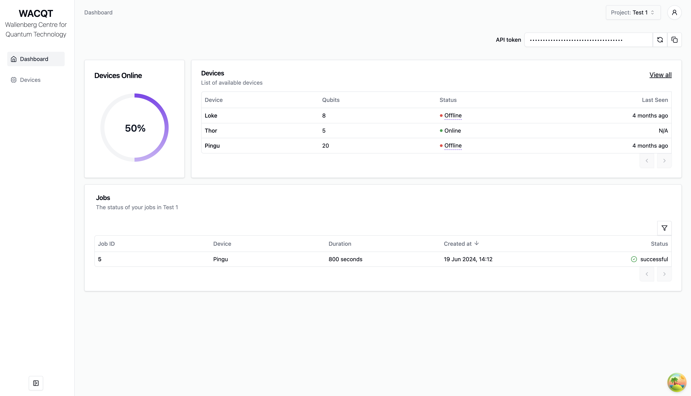
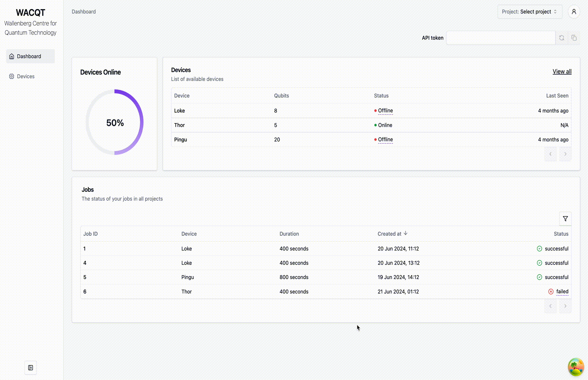

# tergite-frontend

[](https://github.com/tergite/tergite-frontend/actions/workflows/frontend-ci.yml)

The Frontend in the [Tergite software stack](https://tergite.github.io/) of the WACQT quantum computer.

**This project is developed by a core group of collaborators.**
**Chalmers Next Labs AB (CNL) takes on the role of managing and maintaining this project.**


The login screen


The home screen


A preview of the the dashboard

## Version Control

The tergite stack is developed on a separate version control system and mirrored on Github.
If you are reading this on GitHub, then you are looking at a mirror.

## Services

- [Tergite Dashboard](./apps/tergite-dashboard/) [](https://github.com/tergite/tergite-frontend/actions/workflows/dashboard-ci.yml)  
  The website that shows the state of the quantum computer
- [Tergite Main Service Server or MSS](./apps/tergite-mss/) [](https://github.com/tergite/tergite-frontend/actions/workflows/mss-ci.yml)  
  The server that controls all services on this frontend.  
  It also exposes the REST API through which other clients like [tergite SDK](https://github.com/tergite/tergite) communicate with the quantum computers.

## Dependencies

- [docker +v23.0.5](https://www.docker.com/products/docker-desktop/)
- [docker compose](https://docs.docker.com/compose/)
- Linux OS if the `LOGGING_DRIVER` variable in `.env` is set to 'journald' (**recommended**) since [journald is only for Linux](https://forums.docker.com/t/docker-for-windows-logging-failed-to-initialize-logging-driver-journald-is-not-enabled-on-this-host/68690/4).  
  _One could use the default `json-file` logging driver but this would quickly fill up one's disk space after some time. See [here](https://docs.docker.com/config/containers/logging/configure/)_.  
  _One could also use the `local` logging driver but external tools like promtail, our logging aggregator client, cannot work with it. See [here](https://docs.docker.com/config/containers/logging/local/)_

## Getting Started

- Ensure you have [docker](https://docs.docker.com/engine/install/) installed.

- Clone the repo

```shell
git clone git@github.com:tergite/tergite-frontend.git
```

- You might need to login to a hosted docker container registry e.g. one based on the [tergite-registry repo](https://github.com/tergite/tergite-registry),
  especially if you are going to use prebuilt tergite images.

```shell
# e.g. if container registry is hosted at example.com:8002
# and username is johndoe
# and password is password123
CONTAINER_REGISTRY=example.com:8002
DOCKER_USERNAME=johndoe
# feed in password when prompted
docker login ${CONTAINER_REGISTRY} -u $DOCKER_USERNAME
```

- Copy the `mss-config.example.toml` to `mss-config.toml` and update the configuration there.

```shell
cd tergite-frontend
cp mss-config.example.toml mss-config.toml
```

- Create a `.env` file basing on the `.env.example` file.
  Update the variables therein appropriately.

```shell
cp .env.example .env
```

- To rebuild and run the services, use the `fresh-docker-compose.yml`

```shell
docker compose -f fresh-docker-compose.yml up -d
```

- To use prebuilt images to run the services, use the `prebuilt-docker-compose.yml`

```shell
docker compose -f prebuilt-docker-compose.yml up -d
```

- Open your browser at

  - [http://localhost:8002](http://localhost:8002) to see the MSS service
  - [http://localhost:3000](http://localhost:3000) to see the dashboard application

- To ensure that the services start up even on server restarts, run:

```shell
sudo systemctl enable docker
```

- To stop the services, run:

```shell
docker compose stop
```

- To remove stop the services and remove their containers also, run:

```shell
docker compose down
```

## FAQ

### Why can't I access the service?

It could be an issue with your iptables. Check them.

- You could set qal9000 behind an nginx reverse proxy pointing ports 80,443 to the landing page URL (http://localhost:8030), but don't forget to open up your firewall to allow connections on 80,443 ports

```shell
sudo iptables -I INPUT -p tcp -m state --state NEW -m tcp -m multiport --dports 80,443 -j ACCEPT
```

You could add `-s nnn.nnn.n.n/nn ` arg to the above command to limit access to only a given subnet e.g. `-s 255.255.0.0/16`

### Why aren't rules set in ufw working?

When docker is installed, it adds its own `iptables` rules which open all ports by default to the entire world. See [this article](https://docs.docker.com/network/packet-filtering-firewalls/) for more information. In order to customize these rules, new rules have to be added to the DOCKER-USER chain.

You can add other rules in the same DOCKER-USER chain, carefully :-)

## Contribution Guidelines

If you would like to contribute to tergite-frontend, please have a look at our [contribution guidelines](./CONTRIBUTING.md)

## Authors

This project is a work of
[many contributors](https://github.com/tergite/tergite-frontend/graphs/contributors).

Special credit goes to the authors of this project as seen in the [CREDITS](./CREDITS.md) file.

## ChangeLog

To view the changelog for each version, have a look at the [CHANGELOG.md](./CHANGELOG.md) file.

## License

[Apache 2.0 License](./LICENSE)

## Acknowledgements

This project was sponsored by:

- [Knut and Alice Wallenberg Foundation](https://kaw.wallenberg.org/en) under the [Wallenberg Center for Quantum Technology (WACQT)](https://www.chalmers.se/en/centres/wacqt/) project at [Chalmers University of Technology](https://www.chalmers.se)
- [Nordic e-Infrastructure Collaboration (NeIC)](https://neic.no) and [NordForsk](https://www.nordforsk.org/sv) under the [NordIQuEst](https://neic.no/nordiquest/) project
- [European Union's Horizon Europe](https://research-and-innovation.ec.europa.eu/funding/funding-opportunities/funding-programmes-and-open-calls/horizon-europe_en) under the [OpenSuperQ](https://cordis.europa.eu/project/id/820363) project
- [European Union's Horizon Europe](https://research-and-innovation.ec.europa.eu/funding/funding-opportunities/funding-programmes-and-open-calls/horizon-europe_en) under the [OpenSuperQPlus](https://opensuperqplus.eu/) project
