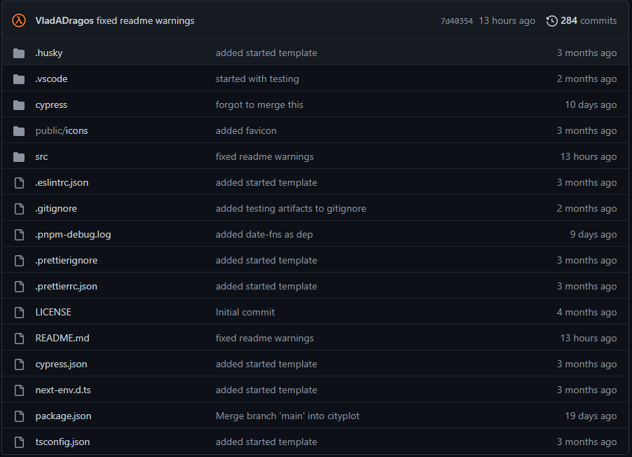

# Frontend docs

# Introduction

We use pnpm as the package manager for the project

The project uses the following frameworks/libraries

**[React:](https://reactjs.org/)**

React is a modern web ui framework

**[Next:](https://nextjs.org/)**

Next is a server-side react framework that has built in bundling and routing among other things

**[Husky:](https://github.com/typicode/husky)**

Husky is a library used to get access to git hooks, we use it in tandem with prettier and eslint to ensure that the code base follows the same code style/format

**[Prettier:](https://prettier.io/)**

Prettier is a code formatter

**[Eslint:](https://eslint.org/)**

Eslint is a javascript/typescript linter, we used the integrated eslint that comes packaged with next

## prerequisites

[Node](https://nodejs.org/en/), [pnpm](https://pnpm.io/)

### installing node

[https://nodejs.org/en/download/](https://nodejs.org/en/download/)

### installing pnpm

```bash
npm i -g pnpm
```

## Usage

install dependencies 

```bash
pnpm i
```

Copy the `.env` file to `.env.local` and update the secret variables in `.env.local`

```
cp .env .env.local
```

run dev server 

```bash
pnpm run dev
```

run tests

```bash
pnpm run teste2e
```

run linter

```bash
pnpm run lint
```

run format

```bash
pnpm run format
```

# Getting started

1. Clone the repo from [https://github.com/Chalmers-Quantum-Computer/frontend](https://github.com/Chalmers-Quantum-Computer/frontend)
2. install dependencies

```bash
pnpm i
```

1. run dev server 

```bash
pnpm run dev
```

# Folder structure

In the root of the project there are two main folders, src and cypress. The src folder contains all of the source files for the application. The cypress folder contains the cypress tests. The rest of the files in the root directory are configuration files.



## Src


**Components**

The first folder of the src directory, components, contains all of the components made. 

**Pages**

The pages directory is a special next folder where each file/folder matches a url path.

For example [localhost/test](http://localhost/test) would match /pages/test.tsx file. These files can also use url parameters see the [next docs](https://nextjs.org/docs/routing/dynamic-routes)  for more information.

**State**

The state directory contains state related code. This is where the [react context](https://reactjs.org/docs/context.html) code is located.

**Utils**

This folder is used for any utility objects/functions.

# Contact

Vlad Dragos vladinatorr@gmail.com  
Jamal Aldiwani plwgamaldiwani@gmail.com  
David Andreasson daandre@student.chalmers.se  
Karl Gunnarsson karlgunnarsson98@gmail.com  
Alexander Jyborn alexander.jyborn@gmail.com  
Lucas Karlsson lucaskode@gmail.com  
